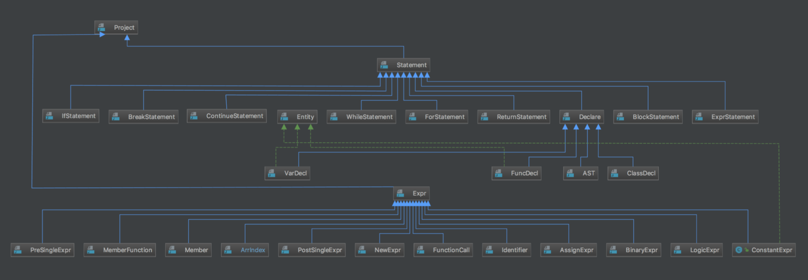
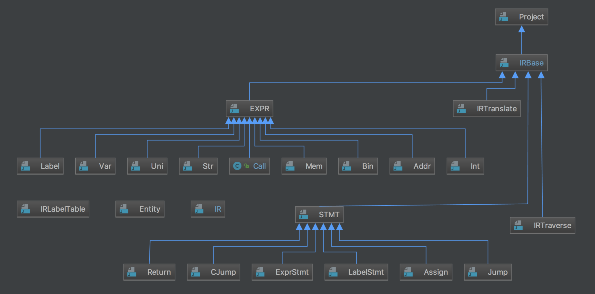
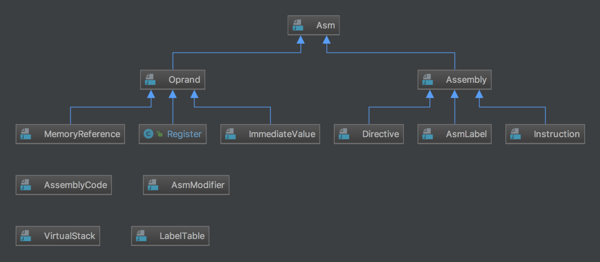

# Maple: A Compiler Translate Mx* Language into X86 Assembly
Project of MS208 Compiler

A PDF to introduce my compiler (written in Chinese): <a href='Presentation.pdf'>Presentation.pdf</a>

Please refer to this course wiki for details:
<a href='https://acm.sjtu.edu.cn/wiki/Compiler_2017'>https://acm.sjtu.edu.cn/wiki/Compiler_2017</a>

## Mx* Language
`Mx*` is a hybriding language of C and Java.
Documents of `Mx*` Language:
<a href='M_language_manual.pdf'>M_language_manual.pdf</a>
## Structure
### Abstract Syntax Tree



### Intermediate language



### ASM Generation



### Usage
```
cd Maple
bash codegen.bash
[Enter your code]
[End with control + d]
```

### Example
```
cd Maple
bash codegen.bash

class TA{
	string state;
	int anger;
}
int init_anger = 100;
int work_anger = 10;
void work(string st, TA ta)
{
	if (ta.anger <= 100) println(st + ", " + ta.state + " enjoys this work. XD");
	else println(st + ", " + ta.state + " wants to give up!!!!!");
	ta.anger = ta.anger + work_anger;
}
int main()
{
	TA mr;
	TA mars;
	mr = new TA;
	mr.state = "the leading TA";
	mr.anger = 0;
	mars = new TA;
	mars.state = "the striking TA";
	mars.anger = init_anger;
	work("MR", mr);
	work("Mars", mars);
	work("Mars", mars);
}

[End with control + d]
```
